<div align="center">

<picture>
  <source media="(prefers-color-scheme: dark)" srcset="https://raw.githubusercontent.com/enmanuel2028/enmanuel2028/main/assets/header-dark.svg">
  <source media="(prefers-color-scheme: light)" srcset="https://raw.githubusercontent.com/enmanuel2028/enmanuel2028/main/assets/header-light.svg">
  
</picture>

<br>

<a href="mailto:manosalvaaceros@gmail.com">
  
</a>
<a href="https://github.com/enmanuel2028">
  
</a>
<a href="https://wa.me/573143741554">
  
</a>


<br><br>


<br>


</div>

## Sobre mí

> **No construyo únicamente interfaces.** Diseño sistemas, entreno modelos, conecto datos
> y convierto ideas complejas en productos tecnológicos que pueden utilizarse en el mundo real.

Soy **Santos Enmanuel Manosalva Aceros**, estudiante de Ingeniería de Sistemas e Informática en la
**Universidad Pontificia Bolivariana** (seccional Bucaramanga), próximo a culminar la formación académica.

Me interesa entender cómo funcionan los sistemas completos: desde la interfaz que utiliza una
persona hasta los servicios, datos y modelos que hacen posible cada resultado. Mi enfoque consiste
en analizar el problema, diseñar una arquitectura clara y construir una solución que pueda
mantenerse, evaluarse y mejorar con el tiempo.

```ts
const santos = {
  rol:        "Ingeniería de Sistemas · IA · Software · Datos",
  enfoque:    ["arquitectura clara", "evaluación real", "producto que se puede mantener"],
  trabajando: ["visión por computador", "pipelines documentales", "SaaS multi-tenant"],
  aprendiendo:"lo que el siguiente problema exija",
  filosofía:  "si no se puede medir ni mantener, no está terminado",
} as const;
```

<div align="center"></div>

## Lo que he construido

<table>
  <tr>
    <td width="50%" valign="top">

### 🛣️ VialAI
**Plataforma SaaS multi-tenant** que detecta y gestiona daños viales con visión por computador,
desde la captura en campo hasta la orden de trabajo.

`Segmentación de instancias` `Mask R-CNN` `Multi-tenancy` `Dashboards georreferenciados`

  </td>
    <td width="50%" valign="top">

### 📑 Vigilancia tecnológica y regulatoria
**Pipeline documental** que convierte PDF y Excel dispersos en un modelo de lectura analítico
con dashboards de tendencias.

`Python` `Monolito modular` `RPC + Read Model` `Streamlit`

  </td>
  </tr>
  <tr>
    <td width="50%" valign="top">

### 💧 Simulador hidráulico
**Arquitectura cliente-servidor**: frontend ejecutable, backend desplegado como servicio
con API y persistencia remota de resultados.

`API REST` `PostgreSQL` `Despliegue en Render`

  </td>
    <td width="50%" valign="top">

### 🤖 Entorno de IA local
**Infraestructura personal** para ejecutar y evaluar modelos de lenguaje sin depender
de servicios externos.

`Ollama` `Modelos locales` `Evaluación` `Linux`

  </td>
  </tr>
  <tr>
    <td width="50%" valign="top">

### 🌐 Presentaciones digitales
**Landings a medida** accesibles por QR, publicadas sin costos recurrentes y con el
código y los recursos en manos del cliente.

`Sitios estáticos` `Cloudflare Pages` `Identidad propia`

  </td>
    <td width="50%" valign="top">

### 🎮 HitDash
**Hack and slash 2D** de dungeon con perspectiva pseudo-3D y dificultad progresiva,
desarrollado en equipo.

`Desarrollo de videojuegos` `Trabajo en equipo` `Diseño de progresión`

  </td>
  </tr>
</table>

> 🔒 También trabajé en la **capa analítica de una plataforma de entrenamiento comercial con IA**:
> evaluación de conversaciones y métricas por rol (vendedor, manager, administrador).
> El proyecto es confidencial, así que no hay enlaces ni detalles de implementación.

<div align="center"></div>

## Stack

<table>
  <tr>
    <td valign="middle"><b>💻&nbsp;Desarrollo</b></td>
    <td>
      
      
      
      
      
      
      
      
    </td>
  </tr>
  <tr>
    <td valign="middle"><b>🧠&nbsp;Inteligencia&nbsp;artificial</b></td>
    <td>
      
      
      
      
      
      
      
    </td>
  </tr>
  <tr>
    <td valign="middle"><b>📊&nbsp;Datos</b></td>
    <td>
      
      
      
      
      
      
    </td>
  </tr>
  <tr>
    <td valign="middle"><b>⚙️&nbsp;Infraestructura</b></td>
    <td>
      
      
      
      
      
      
      
    </td>
  </tr>
</table>

> Sin barras de nivel ni porcentajes: la evidencia de dominio está en los proyectos, no en un número inventado.

<div align="center"></div>

## Actividad

<div align="center">

<picture>
  <source media="(prefers-color-scheme: dark)" srcset="https://github-readme-stats.vercel.app/api?username=enmanuel2028&show_icons=true&include_all_commits=true&count_private=true&rank_icon=github&hide_title=true&bg_color=0B1120&title_color=38BDF8&text_color=94A3B8&icon_color=8B5CF6&border_color=1E293B&border_radius=12">
  <source media="(prefers-color-scheme: light)" srcset="https://github-readme-stats.vercel.app/api?username=enmanuel2028&show_icons=true&include_all_commits=true&count_private=true&rank_icon=github&hide_title=true&bg_color=FFFFFF&title_color=0284C7&text_color=475569&icon_color=7C3AED&border_color=E2E8F0&border_radius=12">
  
</picture>
<picture>
  <source media="(prefers-color-scheme: dark)" srcset="https://github-readme-stats.vercel.app/api/top-langs/?username=enmanuel2028&layout=compact&langs_count=8&hide_title=true&bg_color=0B1120&title_color=38BDF8&text_color=94A3B8&border_color=1E293B&border_radius=12">
  <source media="(prefers-color-scheme: light)" srcset="https://github-readme-stats.vercel.app/api/top-langs/?username=enmanuel2028&layout=compact&langs_count=8&hide_title=true&bg_color=FFFFFF&title_color=0284C7&text_color=475569&border_color=E2E8F0&border_radius=12">
  
</picture>

<br>

<picture>
  <source media="(prefers-color-scheme: dark)" srcset="https://streak-stats.demolab.com?user=enmanuel2028&background=0B1120&border=1E293B&stroke=1E293B&ring=38BDF8&fire=8B5CF6&currStreakNum=F8FAFC&sideNums=F8FAFC&currStreakLabel=38BDF8&sideLabels=94A3B8&dates=64748B&border_radius=12">
  <source media="(prefers-color-scheme: light)" srcset="https://streak-stats.demolab.com?user=enmanuel2028&background=FFFFFF&border=E2E8F0&stroke=E2E8F0&ring=0284C7&fire=7C3AED&currStreakNum=0F172A&sideNums=0F172A&currStreakLabel=0284C7&sideLabels=475569&dates=94A3B8&border_radius=12">
  
</picture>

<br><br>

<picture>
  <source media="(prefers-color-scheme: dark)" srcset="https://github-readme-activity-graph.vercel.app/graph?username=enmanuel2028&bg_color=0B1120&color=F8FAFC&title_color=38BDF8&line=38BDF8&point=8B5CF6&area=true&area_color=1E3A5F&hide_border=true&custom_title=Actividad%20de%20contribuciones">
  <source media="(prefers-color-scheme: light)" srcset="https://github-readme-activity-graph.vercel.app/graph?username=enmanuel2028&bg_color=FFFFFF&color=0F172A&title_color=0284C7&line=0284C7&point=7C3AED&area=true&area_color=BAE6FD&hide_border=true&custom_title=Actividad%20de%20contribuciones">
  
</picture>

<br><br>


<br><br>

<!-- La animación se genera sola con .github/workflows/snake.yml y se publica en la rama `output`. -->
<picture>
  <source media="(prefers-color-scheme: dark)" srcset="https://raw.githubusercontent.com/enmanuel2028/enmanuel2028/output/snake-dark.svg">
  <source media="(prefers-color-scheme: light)" srcset="https://raw.githubusercontent.com/enmanuel2028/enmanuel2028/output/snake-light.svg">
  
</picture>

</div>

<div align="center"></div>

## Cómo trabajo

| Principio | Qué significa en la práctica |
| :-- | :-- |
| **Producto completo** | Del análisis del problema al despliegue, pasando por arquitectura, datos e interfaz. |
| **IA con evaluación real** | Un modelo sin métricas de validación es una demo, no una solución. |
| **Arquitectura antes que código** | Separar responsabilidades primero; el código se escribe una vez y se lee cien. |
| **Nada inventado** | Si un dato no está confirmado, no se publica. |
| **Documentar lo no obvio** | El código dice *qué* hace; la documentación dice *por qué*. |

<div align="center"></div>

<details>
<summary><b>🇬🇧 &nbsp;Read this in English</b></summary>

<br>

**Santos Enmanuel Manosalva Aceros** — Systems & Computer Engineering student at Universidad
Pontificia Bolivariana (Bucaramanga campus), close to completing the degree.

> I don't just build interfaces. I design systems, train models, connect data and turn complex
> ideas into technology products that can be used in the real world.

I care about how complete systems work: from the interface a person uses to the services, data and
models that make every result possible. My approach is to analyze the problem, design a clear
architecture and build a solution that can be maintained, evaluated and improved over time.

**Selected work**

| Project | What it is |
| :-- | :-- |
| **VialAI** | Multi-tenant SaaS that detects and manages road damage with computer vision, from field capture to work order. |
| **Technology & regulatory watch** | Document pipeline turning scattered PDFs and spreadsheets into an analytical read model with trend dashboards. |
| **Hydraulic simulator** | Client–server architecture: executable frontend, deployed backend service with an API and remote persistence. |
| **Local AI environment** | Personal infrastructure to run and evaluate language models without depending on external services. |
| **Digital presentations** | Custom QR-accessible landing pages, shipped with no recurring cost and with the code owned by the client. |
| **HitDash** | 2D hack-and-slash dungeon game with pseudo-3D perspective and progressive difficulty, built as a team. |

I also worked on the analytics layer of an AI sales-training platform — conversation evaluation and
role-aware metrics. That project is confidential, so no links or implementation details are shared.

**How I work** — end-to-end products · AI with real evaluation · architecture before code ·
nothing invented · document the non-obvious.

</details>

<div align="center">


### Hablemos

<a href="mailto:manosalvaaceros@gmail.com">
  
</a>
<a href="https://wa.me/573143741554">
  
</a>

<!--
  Cuando el portafolio esté desplegado, descomenta y pon el dominio final:
  <a href="https://TU-DOMINIO"></a>
  Lo mismo con LinkedIn cuando tengas la URL del perfil.
-->

<br><br>

<sub><i>Engineering intelligence into reality.</i></sub>

<br>


</div>
